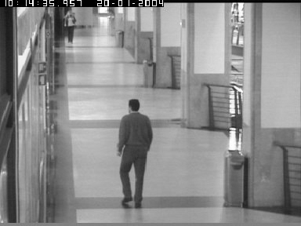
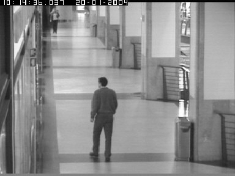
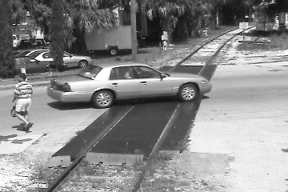
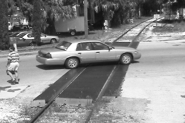
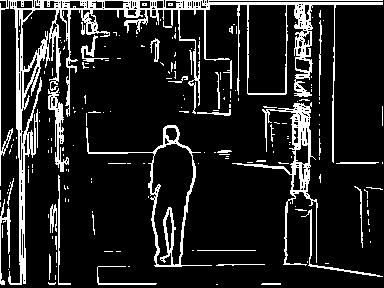
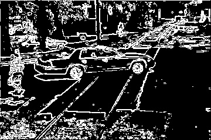
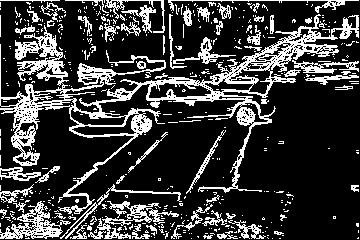

# **Edge Detection**

1.  **Author's Name and Email.**

> Sahil Mirchandani
>
> Sahil.mirchandani\@hotmail.com

2.  **Purpose of the project**

> Edge Detection Using Sobel Operator

3.  **Method**

> Used Sobel Operator To perform edge detection on the given Images.
> Used gaussian matrix to compare the pixel values.
>
> Step 1: Convert the image into segments with 100% overlap
>
> Step 2: Automatically Find the threshold of the image. (To know more
> about threshold, refer to the Image Segmentation)
>
> Step 3: Find gaussian matrix in the x and y direction.
>
> Step 4: Apply the gaussian matrix (x & y) to the segments.
>
> Step 5: calculate the cumulative gradient i.e root of (gradient_x)^2^
> + (gradient_y)^2^.
>
> Step 6: if the cumulative gradient is greater than gradient then
> consider that an edge and color the edge white.
>
> I have used 3x3 matrix as default to detect the edges.

4.  **Results**

> For Video Frame 1:

  **Original image**  
    ------------------------------------------------------------------------------------------------------------------------------------- -----------------------------------------------------------------------------------

  
  
  
  

  **Edged image**
  ------------------------------------------------------------------------------------------------------------------------------------- -----------------------------------------------------------------------------------

