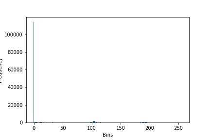
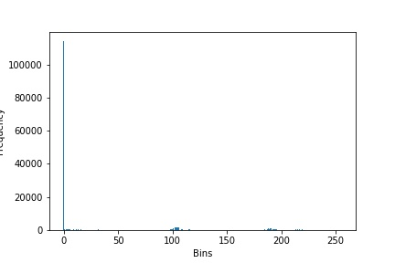
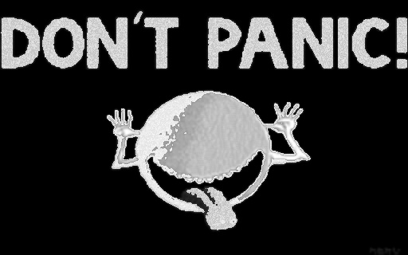
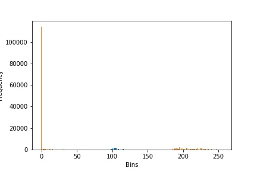
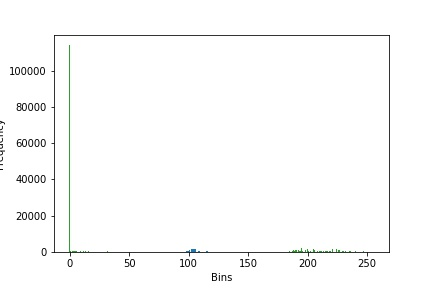
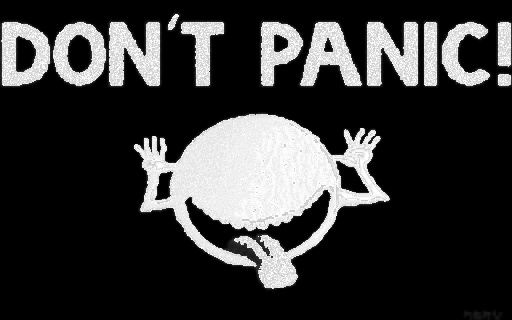
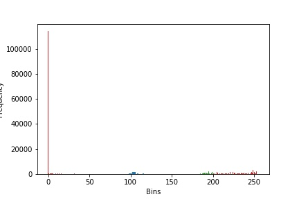
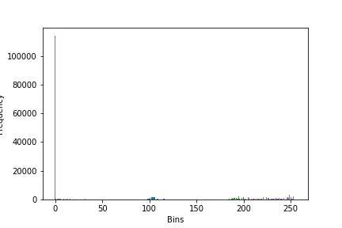
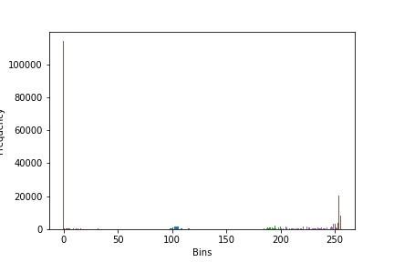

> **Histogram Equalization**

(1) **Author's Name and Email.**

> Name: Sahil Mirchandani
>
> Email: <sahil.mirchandani@hotmail.com>

(2) **Purpose of the project:**

> To demonstrate Image enhancement technique known as Histogram
> Equalization at various levels and window sizes

(3) **Method**

> Implemented a standard Histogram Equalization algorithm at various
> levels and window sizes.
>
> The problem with standard histogram Equalization is that it equalizes
> the whole image which would be not appropriate if the image has many
> pixels of same color for example, black (pixel: 0 ) in our case.
>
> Hence, we choose different Window Sizes and levels so to apply
> histogram equalization on specific part of the image.

(4) **Results**

> Histogram Equalization is a technique to equalize the number of pixels
> in the range specified according to level and window size specified.
>
> Results on Image 1:
>
> **Before Histogram Equalization**

{width="6.479858923884515in"
height="2.0501629483814523in"}

    ------------------------------------------------------------------------------------------------------------------------------------- -----------------------------------------------------------------------------------

**Level 50 window size 30 After Histogram Equalization:**

**Level 50 window size 100 After Histogram Equalization:**

> **Level 100 window size 30 After Histogram Equalization:**

> **Level 100 window size 100 After Histogram Equalization:**

> **Level 150 window size 30 After Histogram Equalization:**

**Level 150 window size 100 After Histogram Equalization:**

> Hence, we can compare the images and their graphs before and after
> equalization at different levels \[50,100,150\] and different window
> sizes \[30,100\]. In reality we can automatically detect best level
> and window size for the image provided.
