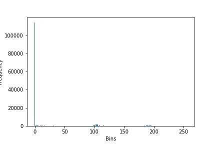
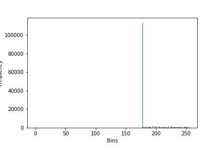

> **Histogram Equalization**

(1) **Author's Name and Email.**

> Name: Sahil Mirchandani
>
> Email: Sahil.mirchandani\@hotmail.com

(2) **Purpose of the project:**

> To demonstrate Image enhancement technique known as Histogram
> Equalization.

(3) **Method**

> Implemented a standard Histogram Equalization algorithm.

(4) **Results**

> Histogram Equalization is a technique to equalize the number of pixels
> in the range specified.
>
> Results on Image :
>
> **Before Histogram Equalization**
    ------------------------------------------------------------------------------------------------------------------------------------- -----------------------------------------------------------------------------------

{width="6.479858923884515in"
height="2.0501629483814523in"}

> **After Histogram Equalization:**
    ------------------------------------------------------------------------------------------------------------------------------------- -----------------------------------------------------------------------------------

Hence, we can compare the images and their graphs before and after
equalization.
