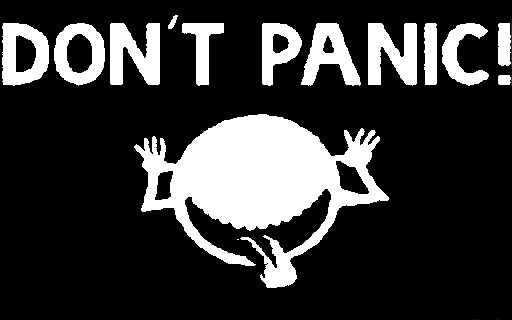
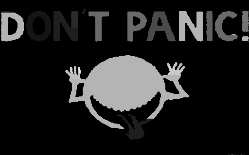

> **Image Segmentation**

(1) **Author's Name and Email.**

> Name: Sahil Mirchandani
>
> Email: <sahil.mirchandani@hotmail.com>

(2) **Purpose of the project:**

> To demonstrate Image Segmentation using 4 connected components
> algorithm

(3) **Method**

    1.  Determined the optimal threshold T automatically.

> Threshold basically separates the background image and the main image
> into separate components. Anything below the threshold is background
> image and anything above the image is our main image.

2.  converted image into binary image 0 and 255 (black and white)

> Using the threshold value, we convert the image into binary image.
> Anything above the threshold is 255 and below is 0.

3.  Applied the 4-connected component algorithm to detect the regions of
    each character in image.

> 4 connected components algorithm is widely used in image segmentation.
> We traverse through the pixels and compare. The pixel value with 4
> places i.e up, down, right, left and then we select the connected
> components

4.  gray scaled different components of image to highlight different
    parts

> For displaying different image segments, I gave each of them with
> different grayscale color and displayed that in an output file.
>
> **(4) Results**
>
> Results on Image 1:

Threshold = 68.82992950758161
=============================

> Original Image

Binary image
    ------------------------------------------------------------------------------------------------------------------------------------- -----------------------------------------------------------------------------------

 Converted Image
    ------------------------------------------------------------------------------------------------------------------------------------- -----------------------------------------------------------------------------------

> We can see that each component is being colored with different color
> in my algorithm.
