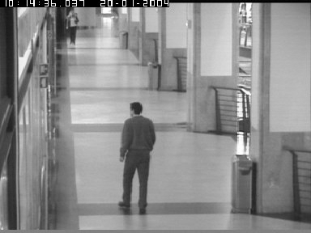
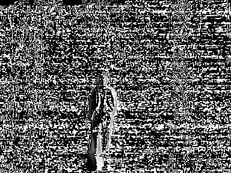
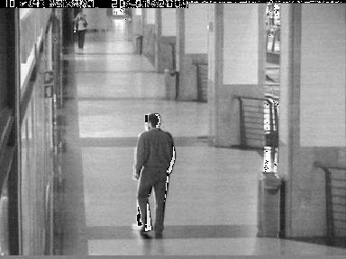

**[Detecting Motion Vectors part 1]{.ul}**

1.  **Author's Name and Email.**

> Sahil Mirchandani
>
> Sahil.mirchandani\@hotmail.com

2.  **Purpose of the project**

> Detect motion vectors by subtracting Pixels.

3.  **Method**

> Step 1: Subtract the pixel values of 2 images (difference(df) = frame
> 1 - frame 2)
>
> Step 2: Apply DCT transformation to the df
>
> Step 3: Apply IDCT to the DCT transformation
>
> Step 4: Reconstruct the image (frame 2) by adding the frame 1 and IDCT

4.  **Uses**

> This method is widely used while transferring image over the internet.
> First frame is transferred over the internet and then their motion
> vectors are transmitted so as to better perform even on the low
> internet speed. After applying compression over the differenced image
> using DCT and transferring over the internet reduces usage of
> bandwidth by over 70% and the image can also be reconstructed by using
> IDCT on the other end Further, combing the 2 images would result into
> the frame 2 which could be displayed by the user.
>
> P.S. Netflix uses it but a modified version Discussed in the second
> part.

5.  **Results**

 Frame 1 
 ------------------------------------------------
 
 
 Frame 2 
 ------------------------------------------------                                                                     

## Difference Image                                                        

                                                

## Reconstructed Image

                                               

