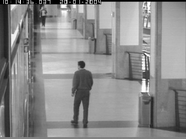

**[Detecting Motion Vectors part 2]{.ul}**

1.  **Author's Name and Email.**

> Sahil Mirchandani
>
> Sahil.mirchandani\@hotmail.com

2.  **Purpose of the project**

> Detect motion vectors by motion detection.

3.  **Method**

> Step 1: Convert the image into blocks with 100% overlap

-   I have chosen block Size of 8 i.e. 8x8 block

> Step 2: Select a method to compare 2 blocks and the search size.

-   I have selected Sum of square pixel values to compare 2 blocks.
    Which indicates that the sum of the pixels is equal then the blocks
    are equal which is fair enough for a video with 10 FPS (frames per
    second) and greater as the pixels does not change too much (P.S.
    Netflix runs on 29 FPS)

-   The search size is 16. i.e 8x8 would be searched into 16x16 in
    frame 2. Example block at (20,20) would be 8x8 (20 - 28) and would
    be searched and matched to the blocks from (16,16) to (24,24)

> Step 3: Compare the block of frame 1 with the blocks within the search
> size of frame 2
>
> Step 4: select the block with matches the maximum and save it motion.

-   The block that has minim ul difference for their respective sums

> Step 5: Save the minimum difference in the block space of frame 1
>
> Step 6: Apply DCT transformation to the motion vectors
>
> Step 7: Apply IDCT transformation at the client side
>
> Step 8: Add the IDCT output and frame 1 to get the frame 2.

1.  **Uses**

> This method is widely used while transferring image over the internet.
> First frame is transferred over the internet and then their motion
> vectors are transmitted so as to better perform even on the low
> internet speed. After applying compression over the motion vector
> image using DCT and transferring over the internet reduces usage of
> bandwidth by over 90% and the image can also be reconstructed by using
> IDCT on the other end Further, combing the 2 images would result into
> the frame 2 which could be displayed by the user.
>
> P.S. Netflix uses this algorithm

2.  **Results**

## Frame 1 
| 
## Frame 2

## Difference Image                                                                                                                                
                                                

## Reconstructed Image                                                

