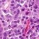
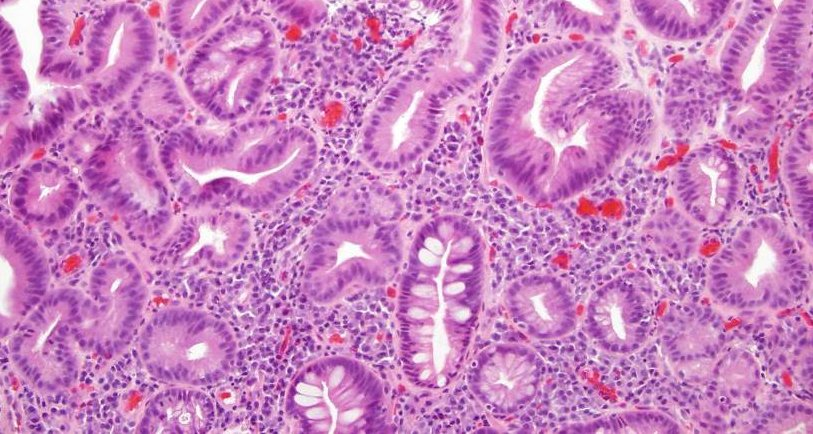
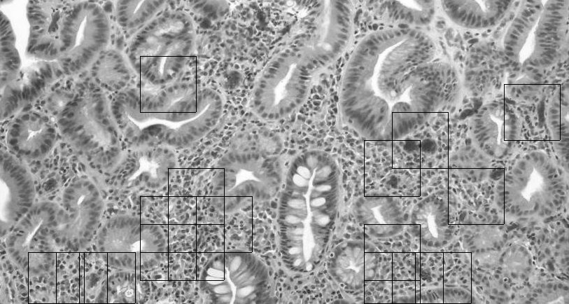
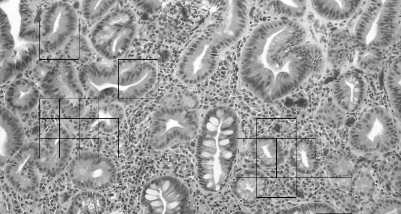
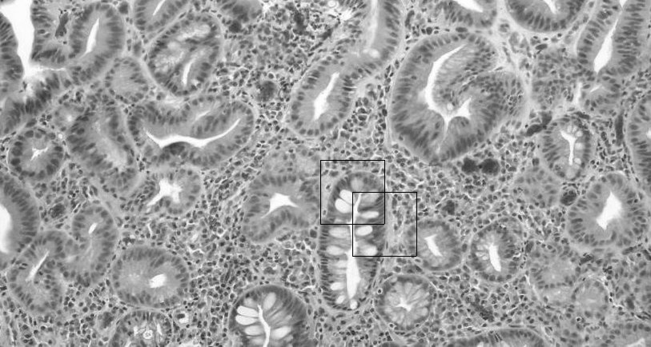

> **(1) Author's Name and Email.**
>
> Sahil Mirchandani
>
> Smircha1\@binghamton.edu
>
> **(2) Purpose of the project**
>
> Categorize class into 3 types
>
> 
>["ClassB"](OutputImages/ClassB.jpg)
>["ClassC"](OutputImages/ClassC.jpg)
>
> Class 1 Class 2 Class 3
>
> **(3) Method**

Step1: rectify manually a block of the image and classify them as Class
A , Class B , Class C

Step2: Convert the image into blocks with the overlap of 50% and perform
following to match the block with classes:

a.  Histogram Analysis.

> Create an Histogram of the colors in the image and then compare with
> the histogram of classes so that we can get an matching criteria

b.  Sum of block:

Take the sum of pixels of block to match and calculate percentage match

Step3: Calculate the cumulative percentage by considering 70% of
histogram analysis output and 30% of Sum of matching block output.

Step4: If the matching criteria calculated in Step 3 is more than. 85%
in any of the class then categorize block into the class

> **(4) Results**

    ------------------------------------------------------------------------------------------------------------------------------------- -----------------------------------------------------------------------------------

