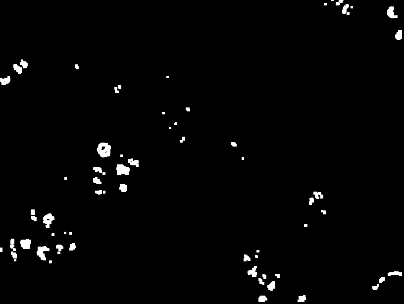

> **(1) Author's Name and Email.**
>
> Sahil Mirchandani
>
> Sahil.mirchandani\@hotmail.com
>
> **(2) Purpose of the project**
>
> Detect Abnormal Cells in an image containing information of cells
>
> **(3) Method**
>
> **Step1:** I chose the BGR value of the abnormal cell and converted
> the image to just select that cells and make the remaining image
> black.
>
> 
>
>
> Step 2: Apply Erosion to the Converted image to erode the unwanted
> parts of image.
>
>
>
>
> Step 3: Apply Dilation to the eroded image
>
>
>
>
> Step 4: Label the abnormal cells to the original Image
>
> 
>
> Step 5: Count the number of connected Components in the dilated image
> by using 4-connected algorithm used in previous assignment.
>
>
> **(4) Results**
>
> {width="2.911111111111111in"
> height="2.1904680664916887in"}
>
> Number of abnormal cells in the image are **37**

